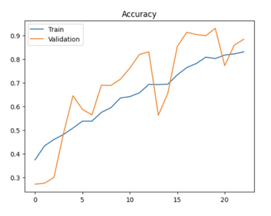
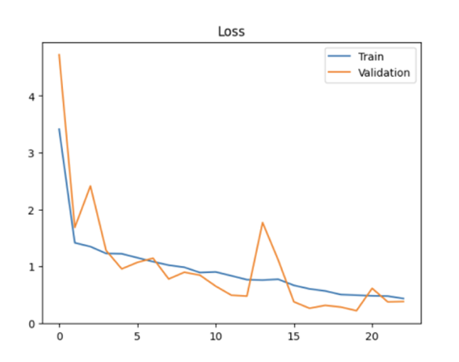
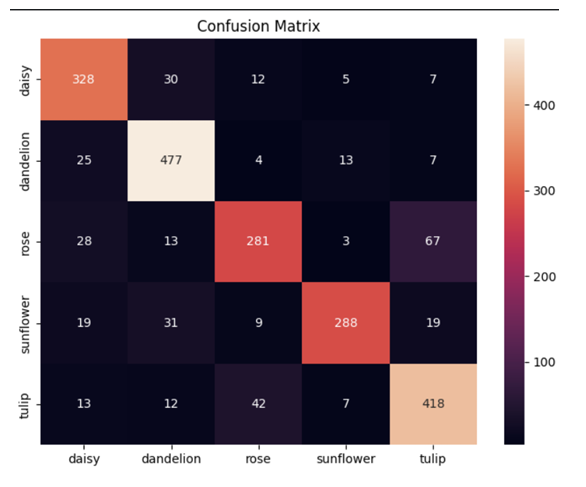
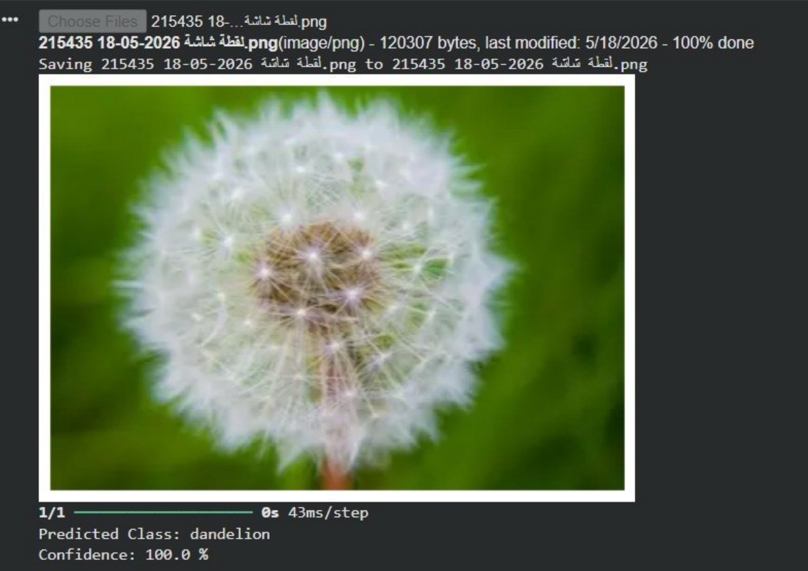
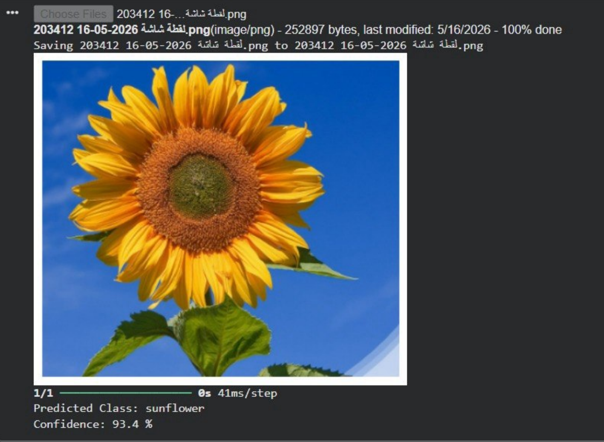

# 🌸 Flower Classification Using Convolutional Neural Network (CNN)

A deep learning project that implements a Convolutional Neural Network (CNN) to classify flower images into multiple categories. The model was developed using TensorFlow and Keras and demonstrates the application of computer vision techniques for image classification tasks.

---

## 📌 Project Overview

Image classification is one of the most important applications of Deep Learning and Computer Vision. This project develops a CNN model capable of automatically recognizing flower species from images by learning visual features such as colors, textures, and shapes.

---

## ✨ Key Features

- Custom CNN architecture built from scratch
- Image preprocessing and normalization
- Exploratory Data Analysis (EDA)
- Batch Normalization
- Dropout Regularization
- Early Stopping
- Accuracy and Loss visualization
- Classification Report
- Confusion Matrix
- Prediction on unseen flower images

---

## 🎯 Objectives

- Explore and visualize the flower dataset.
- Preprocess image data for CNN training.
- Build a custom CNN model.
- Train and evaluate the model.
- Predict flower classes from new images.
- Analyze classification performance.

---

## 📂 Dataset

This project uses the **Flowers Recognition Dataset** available on Kaggle.

Dataset Link:

https://www.kaggle.com/datasets/alxmamaev/flowers-recognition

Dataset Characteristics

- RGB Images
- Multiple flower classes
- Image size: 128 × 128
- Training split: 80%
- Validation & Testing: 20%

---

## 📊 Exploratory Data Analysis

EDA was performed to better understand the dataset before training.

The analysis included:

- Class distribution visualization
- Sample image visualization
- Dataset balance inspection

---

## 🔄 Data Preprocessing

The preprocessing pipeline included:

- Image resizing (128×128)
- Pixel normalization (1/255)
- Data splitting
- Data shuffling
- ImageDataGenerator

---

## 🧠 CNN Architecture

The implemented model consists of:

### Block 1

- Conv2D (32 Filters)
- Batch Normalization
- MaxPooling2D

### Block 2

- Conv2D (64 Filters)
- Batch Normalization
- MaxPooling2D

### Block 3

- Conv2D (128 Filters)
- Batch Normalization
- MaxPooling2D

### Fully Connected Layers

- Flatten
- Dense (256)
- Dropout (0.5)

### Output Layer

- Softmax Activation

---

## ⚙️ Model Configuration

| Parameter | Value |
|------------|-------|
| Optimizer | Adam |
| Loss Function | Categorical Crossentropy |
| Metric | Accuracy |
| Epochs | 25 |
| Early Stopping | Yes |

---

## 📈 Results

The CNN model achieved a **test accuracy of 83.03%** on unseen flower images.

The evaluation included:

- Accuracy Curve
- Loss Curve
- Classification Report
- Confusion Matrix
- Prediction Confidence

The model demonstrated good generalization performance on unseen flower images.

### 📊 Accuracy Curve

### 📉 Loss Curve

### 🔍 Confusion Matrix

---

## 🌼 Sample Predictions

### Prediction Example 1

### Prediction Example 2

---

## 🚀 Future Improvements

- Apply Transfer Learning (MobileNetV2, ResNet50, EfficientNet)
- Hyperparameter Tuning
- Larger Dataset
- Data Augmentation
- Streamlit Deployment

---

## 🛠 Technologies Used

- Python
- TensorFlow
- Keras
- NumPy
- Matplotlib
- Seaborn
- Scikit-learn
- Pillow
- Google Colab

---

---

## 👩‍💻 Team Members

- Reham Alhmaidi
- Lojain Alahmadi
- Lama Alqahtani

---

## 📄 License

This project is intended for educational and learning purposes.
